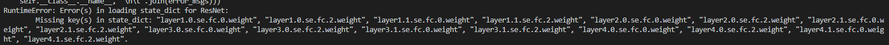

# SENet

## insight

> In SENet, Channel-Wise Attention enables the model to learn the weight of each channel, and then multiplies the weight back to the original channel. The features of those important channels are enhanced, and the insignificant are weakened, so that the extracted features are more directional and the network predicts better.
[Channel Distillation: Channel-Wise Attention for Knowledge Distillation](https://arxiv.org/abs/2006.01683)

SENet 具有 channel-wise attention

## bug

# Channel Distillation

>We use GAP to calculate the importance of each channel’s feature map, which represnets attention information of each channel. Then we consider the attention information of each channel’s feature map as knowledge. The
[Channel Distillation: Channel-Wise Attention for Knowledge Distillation](https://arxiv.org/abs/2006.01683)

仅用了 GAP 去计算特征图的weights
虽然此方法0参数，但是由于 GAP 输出的是每个通道 feature map 的统计结果，作为 attention 仍对效果有提升

# ECA-Net

>we empirically show avoiding dimensionality reduction is important for learning channel attention, and appropriate cross-channel interac- tion can preserve performance while significantly decreas- ing model complexity.

- SENet 的降维操作对精度有损失
- 适当的通道间交互可以在保持性能时也降低模型复杂度

# CondConv

## references
[CondConv：按需定制的卷积权重](https://aijishu.com/a/1060000000021494)
介绍了很多和分支，条件计算有关的论文

# Non-local Neural Networks

## references
[Non-local neural networks-zhihu]()

