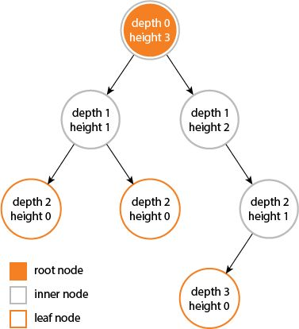

## 定义
> In computer science, a tree is a widely used abstract data type that simulates a hierarchical tree structure, with a root value and subtrees of children with a parent node, represented as a set of linked nodes.

### height depth
> The height of a node is the length of the longest downward path to a leaf from that node. The height of the root is the height of the tree. The depth of a node is the length of the path to its root (i.e., its root path).
>* 深度：对于任意节点n,n的深度为从根到n的唯一路径长，根的深度为0；
>* 高度：对于任意节点n,n的高度为从n到一片树叶的最长路径长，所有树叶的高度为0；

### 参考
[Tree (data structure)](https://en.wikipedia.org/wiki/Tree_(data_structure))
[树的高度于深度不一样，高度从1数起，深度从0数起，对吗？](https://www.zhihu.com/question/40286584)
[What is the difference between tree depth and height?](https://stackoverflow.com/questions/2603692/what-is-the-difference-between-tree-depth-and-height)
