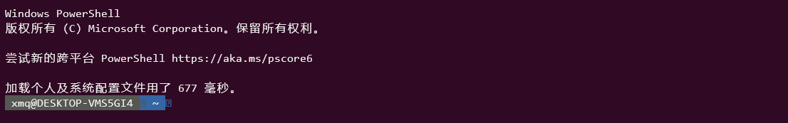

## Alias设置

### 策略
获取与修改策略级别（需要管理员权限）
```language
Get-ExecutionPolicy
Set-ExecutionPolicy Unrestricted
```

### 配置文件
配置文件应该位于
```language
C:\Users\user\Documents\WindowsPowerShell\Microsoft.PowerShell_profile.ps1
```

若无，生成配置文件，重复直到第一句输出为True
```language
test-path $Profile
New-Item -Path $Profile -ItemType file -Force
```
输入别名指令
```language
notepad $Profile
```
例如，在配置文件中输入
```language
function 别名 { 需要替代的命令，可以包含空格 }
```
重新打开PS，生效

### 参考
[Windows PowerShell 配置文件](https://forsenergy.com/zh-cn/windowspowershellhelp/html/9c82251c-6f0d-416a-9c3c-77838218531b.htm)

[为 Windows PowerShell 设置 User Alias （命令别名）](https://blog.vvzero.com/2019/07/22/set-user-alias-for-windows-PowerShell/)

[【探索PowerShell 】【三】PowerShell下使用Aliases](https://blog.51cto.com/marui/290067)

## 美化

### 安装oh-my-posh和posh-git
```language
# 阅读提示，正确选择y和n（会出现不受信任的存储库）
Install-Module posh-git -Scope CurrentUser
Install-Module oh-my-posh -Scope CurrentUser

```
打开配置文件
```language
if (!(Test-Path -Path $PROFILE )) { New-Item -Type File -Path $PROFILE -Force } notepad $PROFILE
```
写入，每次打开PS都生效
```language
Set-Prompt
Get-Theme
# 感觉这个主题最好看
Set-Theme Powerline
```


### 安装ScreenFetch
```language
Install-Module windows-screenfetch -Scope CurrentUser
```
打开配置文件（此步骤同上），加入
```language
Screenfetch
```
.png)

### BUG
```language

```


